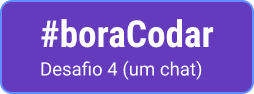

  

  

## 💻 Projeto

Aplicação de um Chat proposto como 4º Desafio do projeto #boraCodar da Rocketseat. 

Inicialmente o objetivo do desafio consistia em criar uma página seguindo o design desenvolvido no Figma pela instituição, sem implementar qualquer aplicabilidade.

Inspirado em entregar além do que foi pedido, decidi implementar algumas funcionalidades que permitisse ao usuário interagir com a aplicação.

Essa aplicação é responsiva permitindo ao usuário acessa-la desde desktop a smartphone de modo confortável e usável.

## ✨ Tecnologia

- [HTML](https://developer.mozilla.org/pt-BR/docs/Web/HTML)
- [CSS](https://developer.mozilla.org/pt-BR/docs/Web/CSS/)
- [Javascript](https://developer.mozilla.org/pt-BR/docs/Web/JavaScript)
- [phosphor icons](https://phosphoricons.com/)

## 🚀 Como executar

- Copie os 3 arquivos (index.html, style.css e main.js) em uma mesma pasta.
- Abra o arquivo `index.html` no seu navegador preferido para iniciar a página web.

## 🔖 Layout

Você pode visualizar o layout do projeto através do link abaixo:

- [Layout](https://www.figma.com/file/9PoqXsh6I8qrYaPXNNwBAO/%23boraCodar---Desafio-4-(Community)?node-id=0%3A1&t=0KmSxdD3ENRJJmka-1)

Lembrando que você precisa ter uma conta no [Figma](http://figma.com/).

## 📝 License

Esse projeto está sob a licença MIT. Veja o arquivo [LICENSE](LICENSE) para mais detalhes.

---

  Feito com 💙 by Dárcio Carvalho

  Desenvolvido by Rocketseat :wave: <a href="https://discord.gg/rocketseat">Participe da nossa comunidade!</a> 

